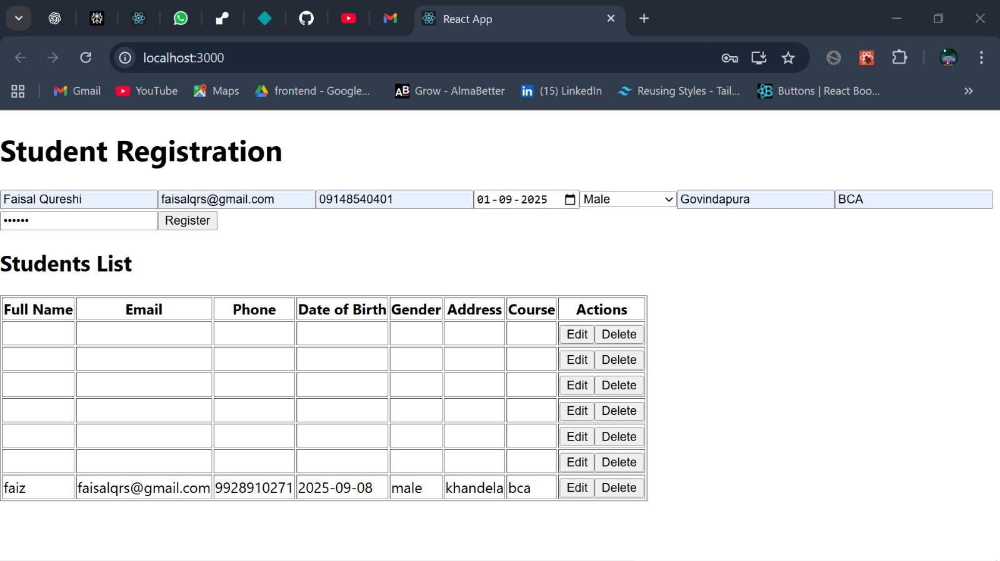
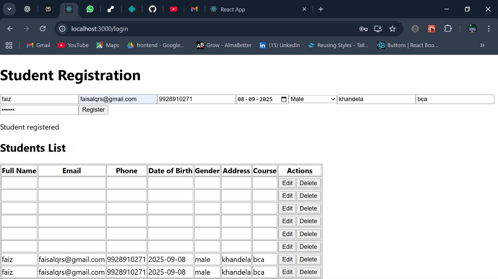
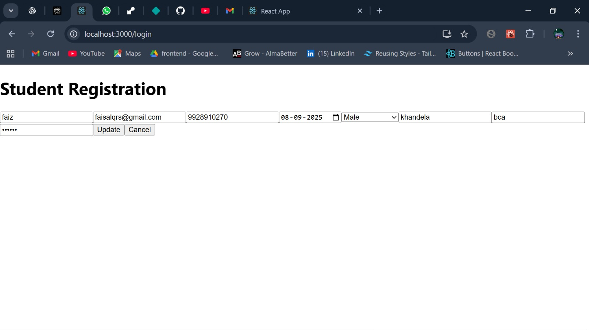
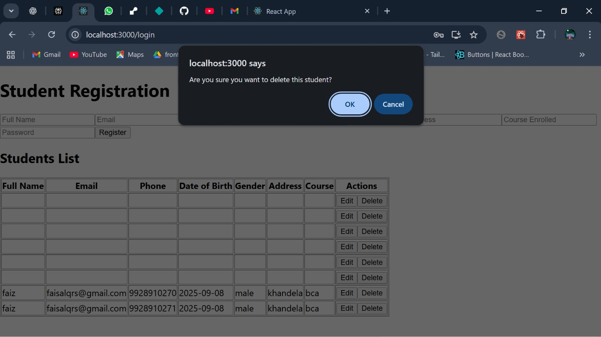

# Student Registration MERN App

This project is a student registration application built using the MERN stack (MongoDB, Express, React, Node.js) & TypeScript. It implements full CRUD operations with AES encryption for secure data transmission between frontend and backend.

## Features

- Register students with encrypted data
- List all registered students with decrypted data display
- Update student details securely
- Delete student records
- AES encryption ensures data security in transit

## Technologies Used

- React with TypeScript for frontend
- Node.js with Express & typescript for backend
- MongoDB for database
- CryptoJS for AES encryption/decryption

## Installation and Setup

1. Clone this repository:

git clone https://github.com/faizqrs/student-registration-CRUD.git
cd student-registration-CRUD

text

2. Install dependencies for backend and frontend:

cd backend
npm install

cd ../frontend
npm install

text

3. Run MongoDB locally or use a MongoDB cloud service.

4. Configure backend `.env` or configuration files for secret keys and MongoDB URL if needed.

5. Start backend server:

cd backend
npm start

text

6. Start frontend server:

cd frontend
npm start

text

7. Open http://localhost:3000 in the browser.

---

## Project Structure

- `/server` - Express.js server, routes, controllers, models
- `/client` - React app with components and utilities

---

## Encryption

AES encryption is used for data sent from frontend to backend and vice versa. Both ends share the same secret key stored securely.

---
## Screenshots

## License

This project is licensed under the MIT License.

---

## Contact

For questions and contributions, please reach out at faisalqrs19@gmail.com.
